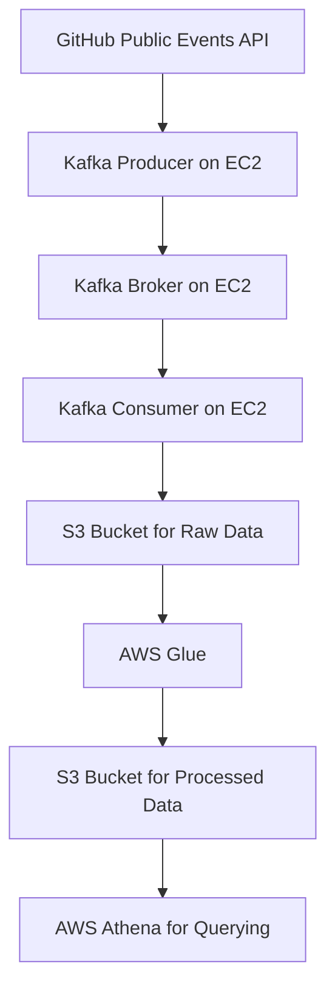

# **GitHub Public Events Streamer**

This project leverages **Apache Kafka** to stream live data from the **GitHub Public Events API**, enabling real-time analytics on open-source contributions and development activities. By processing various GitHub events like commits, pull requests, issues, and forks, the system provides actionable insights into trends and patterns within the open-source community.

## **Project Workflow:**

### **1. Data Ingestion:**
The data pipeline begins with ingesting live events from the **GitHub Public Events API**, which provides a continuous feed of all public actions occurring on GitHub repositories. Events captured include:
- **PushEvent**: Commits made to repositories.
- **PullRequestEvent**: Creation and merging of pull requests.
- **IssuesEvent**: Issue creation, updates, and closures.
- **ForkEvent**: Forking of repositories.

These events are fetched at regular intervals and transformed into a structured format (JSON) for further processing.

### **2. Kafka Producer:**
The **Kafka producer** component, built using `kafka-python`, is responsible for pushing the JSON-formatted GitHub event data to a Kafka topic in real time. This ensures scalability and fault-tolerance in data transmission.

#### **Key Kafka Producer Details:**
- **Topic**: Events are published to a specific Kafka topic (e.g., `github-events`).
- **Partitioning**: Kafka’s partitioning mechanism is used to distribute data across different partitions for load balancing.
- **Message Delivery**: The producer sends JSON messages, where each message contains details of a GitHub event such as the repository, event type, timestamp, and user involved.

#### **Kafka Producer Code Example:**
```python
from kafka import KafkaProducer
import json

producer = KafkaProducer(
    bootstrap_servers='broker_address:9092',
    value_serializer=lambda v: json.dumps(v).encode('utf-8')
)

# Send a GitHub event to the 'github-events' topic
producer.send('github-events', {
    'repo': 'repo_name',
    'event_type': 'PushEvent',
    'timestamp': '2024-09-23T12:34:56Z',
    'user': 'username'
})
producer.flush()
```

### **3. Kafka Broker:**
The **Kafka broker** serves as the middle layer, receiving and storing messages produced by the Kafka producer. It manages the distribution of messages across partitions and ensures messages are replicated to guarantee fault tolerance.

### **4. Kafka Consumer:**
The **Kafka consumer** listens to the same topic, `github-events`, and processes the incoming stream of GitHub event data. This data is then transformed for analysis or forwarded to a storage system for persistence.

#### **Key Kafka Consumer Details:**
- **Real-time Processing**: Processing and aggregating event data to generate insights, such as the number of commits per repository, or top contributors.
- **Batch Processing**: Periodic aggregation of data to compute more complex analytics, such as contributor trends or pull request resolution times.

#### **Kafka Consumer Code Example:**
```python
from kafka import KafkaConsumer
import json

consumer = KafkaConsumer(
    'github-events',
    bootstrap_servers='broker_address:9092',
    auto_offset_reset='earliest',
    value_deserializer=lambda x: json.loads(x.decode('utf-8'))
)

for message in consumer:
    event_data = message.value
    process_event(event_data)  # Custom function to process and analyze event data
```

### **5. Data Storage:**
After the consumer processes the data, it is stored in a **persistent storage system** for further analysis. The storage solutions can include:
- **NoSQL databases** like **MongoDB** to store unstructured event data in JSON format.
- **Relational databases** like **PostgreSQL** or **MySQL** for storing aggregated metrics and analytics results.

### **6. Real-time Analytics and Dashboards:**
Using the streamed data, I performed analytics to uncover key patterns in open-source contributions. Some of the analytics include:
- **Top Contributors**: Identifying the users who made the most contributions across repositories.
- **Event Frequency**: Tracking the frequency of GitHub events over time to detect peaks in activity.
- **Time to Resolution**: Analyzing the time taken to close issues or merge pull requests.
- **Repository Activity**: Visualizing the most active repositories and understanding their contribution patterns.

The real-time analytics results are visualized on a **dashboard** using tools like **Grafana** or **Streamlit**, providing live insights into ongoing GitHub events.

## **Key Kafka Details:**
- **Producer-Consumer Architecture**: The project follows a classic producer-consumer model, where the producer streams data into Kafka and the consumer processes it in real time.
- **Fault Tolerance**: Kafka ensures that the data stream is replicated across multiple brokers, enabling fault tolerance. This makes the system resilient to failures during data transmission.
- **Scalability**: Kafka’s partitioning and replication mechanisms allow for scaling as the volume of GitHub events increases.
- **Real-Time Data Pipeline**: By using Kafka, this project creates a real-time pipeline for continuously ingesting and analyzing GitHub events without delays.

## AWS Ecosystem for Kafka Data Streaming and Analytics

This project leverages various AWS services to stream and analyze GitHub Public Events data in real-time. Below is the detailed architecture:

### 1. **EC2 Instance for Kafka Producer & Consumer**
The Kafka producer and consumer are hosted on an Amazon EC2 instance. This provides the flexibility to handle high-throughput streaming of GitHub events.

- **Instance Setup:**
  - EC2 is provisioned with enough CPU and memory resources to support Kafka's message processing.
  - Kafka is installed and running on the EC2 instance.
  - To facilitate the development process, JupyterHub is deployed on the local machine and connects to the EC2 instance for easy access to the Kafka producer and consumer.

#### **Steps to Connect JupyterHub to EC2 Instance**
- First, ensure the EC2 instance is running and SSH access is enabled.
- Open JupyterHub on your local machine and establish an SSH tunnel to the EC2 instance.
  
```bash
ssh -i "your-ec2-key.pem" -L 8888:localhost:8888 ec2-user@<ec2-instance-ip>
```

- Now you can access your Jupyter notebook in the browser and use it to interact with the Kafka producer and consumer running on EC2.

### 2. **Kafka Producer & Consumer Setup**

- The producer reads real-time GitHub Public Events data and streams it into Kafka.
- The consumer listens to the topic and processes these events.

#### **Kafka Producer**
The Kafka producer is responsible for sending GitHub Public Events to the Kafka broker.

```python
from kafka import KafkaProducer
import json

producer = KafkaProducer(
    bootstrap_servers=['<EC2-Kafka-Broker-IP>:9092'],
    value_serializer=lambda v: json.dumps(v).encode('utf-8')
)

message = {'event_type': 'PushEvent', 'repo': 'octocat/Hello-World'}
producer.send('github_events', value=message)
producer.flush()
```

#### **Kafka Consumer**
The Kafka consumer reads messages from the Kafka topic and prints them for processing.

```python
from kafka import KafkaConsumer

consumer = KafkaConsumer(
    'github_events',
    bootstrap_servers=['<EC2-Kafka-Broker-IP>:9092'],
    auto_offset_reset='earliest',
    enable_auto_commit=True,
    value_deserializer=lambda x: json.loads(x.decode('utf-8'))
)

for message in consumer:
    print(f"Received message: {message.value}")
```

### 3. **AWS Glue for Data Processing**
AWS Glue is used for ETL (Extract, Transform, Load) operations on the streaming data. After the Kafka consumer reads the GitHub event messages, the data is written to S3. AWS Glue is then triggered to process this data.

- **AWS Glue Jobs:**
  - AWS Glue extracts raw event data from the S3 bucket.
  - Transformations are applied (e.g., parsing the event type and repository information).
  - The processed data is stored back in another S3 bucket.

```python
import boto3

glue = boto3.client('glue')
response = glue.start_job_run(JobName='github_events_etl')
```

### 4. **Athena for Querying Processed Data**
AWS Athena is used to query the processed data stored in S3. Athena allows for serverless querying of the data using standard SQL.

- **Athena Setup:**
  - The Glue catalog is used to define the schema of the data.
  - Athena queries are written to extract insights like top repositories, contributors, and event trends.

```sql
SELECT event_type, COUNT(*) 
FROM github_events
GROUP BY event_type;
```

### 5. **Architecture Diagram**



### Conclusion

This project demonstrates how to stream real-time data from GitHub using Kafka, process it with AWS Glue, and run analytics using AWS Athena. The architecture is highly scalable and allows for handling large volumes of streaming data while performing real-time analytics efficiently.
